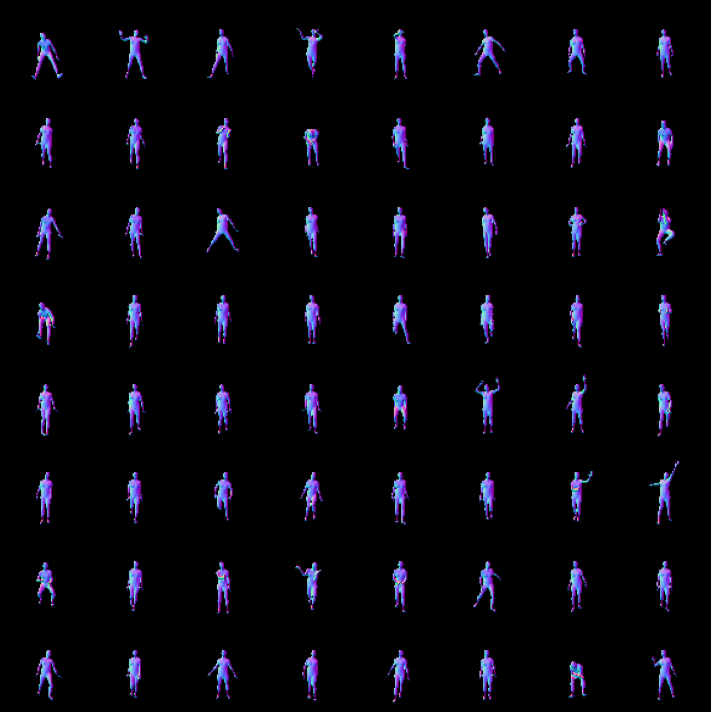
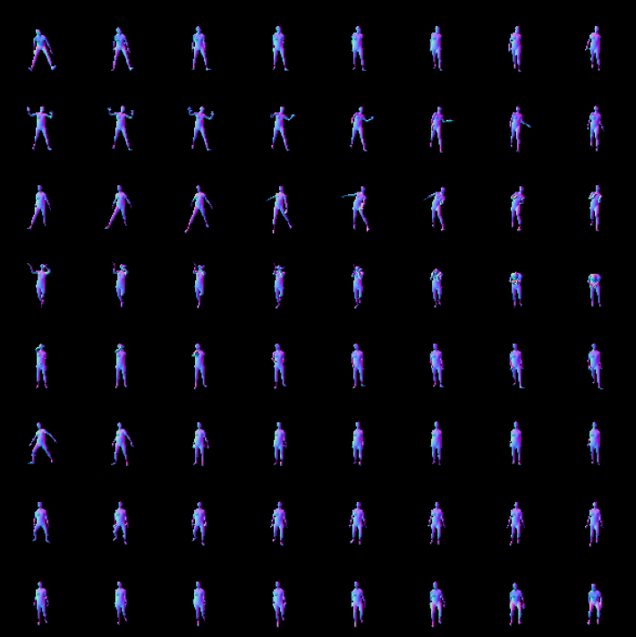

# Demos

Common recommendations on image rendering:
- For `batch_size_max` (# images rendered in parallel), it is recommended to use ~20 for CPU and ~100 GPU.
- For `img_size` (dimension of rendered images), it is recommended to use ~64 for CPU, 512-1024 for GPU.

Below we show examples of sampling and interpolating on CPU with `img_size` 64 and `batch_size_max` 20.

## Sampling

The notebook [`sampling.ipynb`](sampling.ipynb) provides code for random sampling from the generative model and rendering body images.
Details on sampling from different prior distributions can be found [here](./../lib/functional/sampling.py).

 

<h4 align="center">Examples of sampling from GAN-S pose prior</h4>

## Interpolation

The notebook [`interpolation.ipynb`](interpolation.ipynb) provides code for interpolating in the latent space and rendering sequences of body images. 
The details on interpolation procedures can be found [here](./../lib/functional/interpolation.py).

 

<h4 align="center">Examples of spherical interpolations (between random latents from left to right) from GAN-S pose prior</h4>